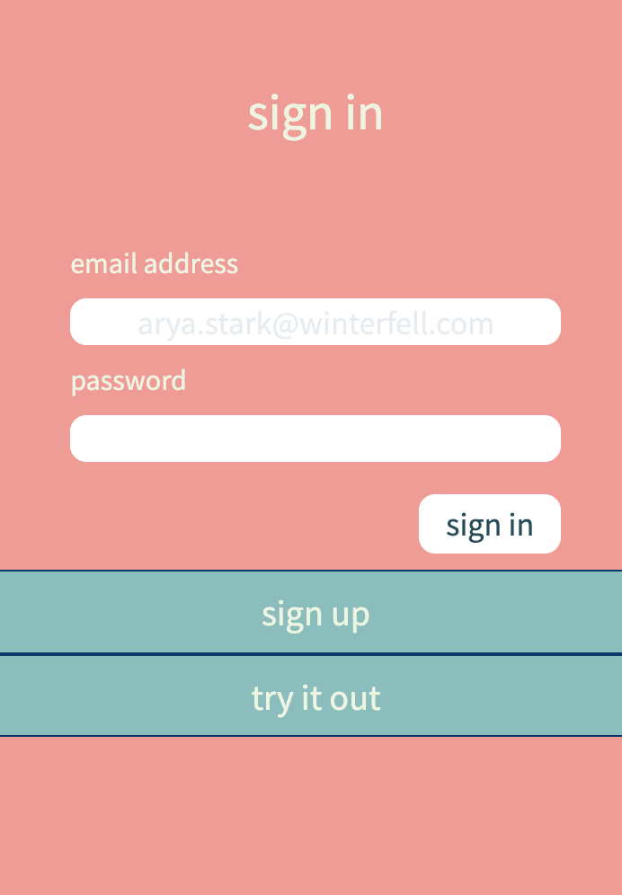
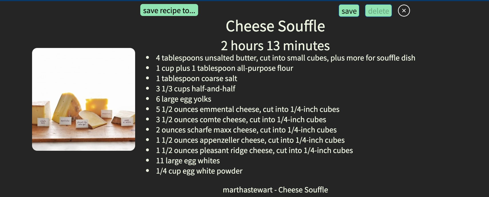
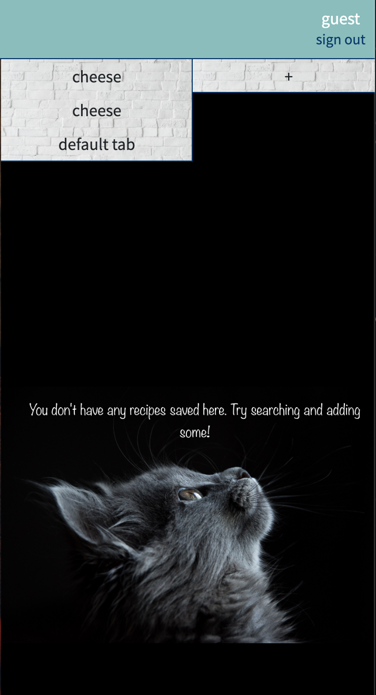
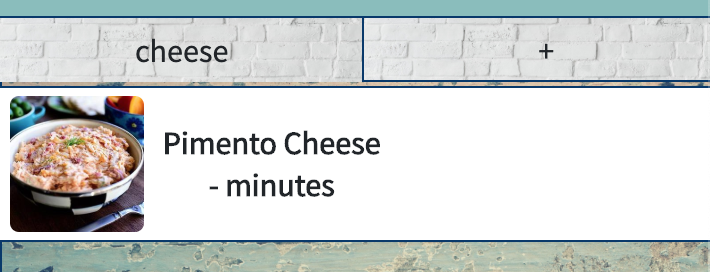

# Recipe Box

`Created by Zuoyi Phang, Eugene Halpin, Thomas Lewis, and Zach Carey`

## Introduction

### About

Recipe Box is the recipe saver you've been missing. You can search your favoritie ingrediants or categories and you will be populated with a couple dozen recipes. You can save your recipes and you can create a folder for your own favorites or categorize them to your liking. If you dont like something ater you have added, you can remove them with our friendly UI.

## Methods Used:

- Edamam.com Recipe API
- HTML/ CSS
- Javascript
- AJAX
- Firbase Authentication

## Screenshots

You will be prompted with a home screen that welcomes you. If you click on the top right of the screen you can login or sign up.

Here you are prompted to either login/ sign up but you can also just try out as a guest. However with the guest, if you log out you ill loss all your saved recipes. With your own account, you can save all the recipes and it will remain inside as long as until you delete the recipes.

Here is th e populated search that will appear after you search something.

Within those search results, you can click on anyone and it will give you an option to save or delete. You also get the recipe for that specific recipe. If you click on it again it will prompt you to a third party website where the recipe is actually pulld from.

This is the box that you have all your saved recipes. You can add more categories and even delete them if you are done with them.

This is just showing you the saved recipe inside your box.

## Heroku

https://recipe-box-unc-project1.herokuapp.com/
